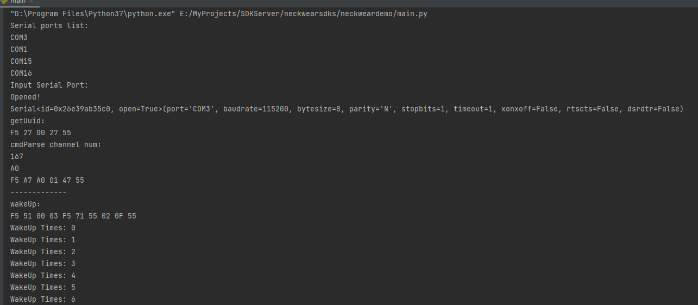
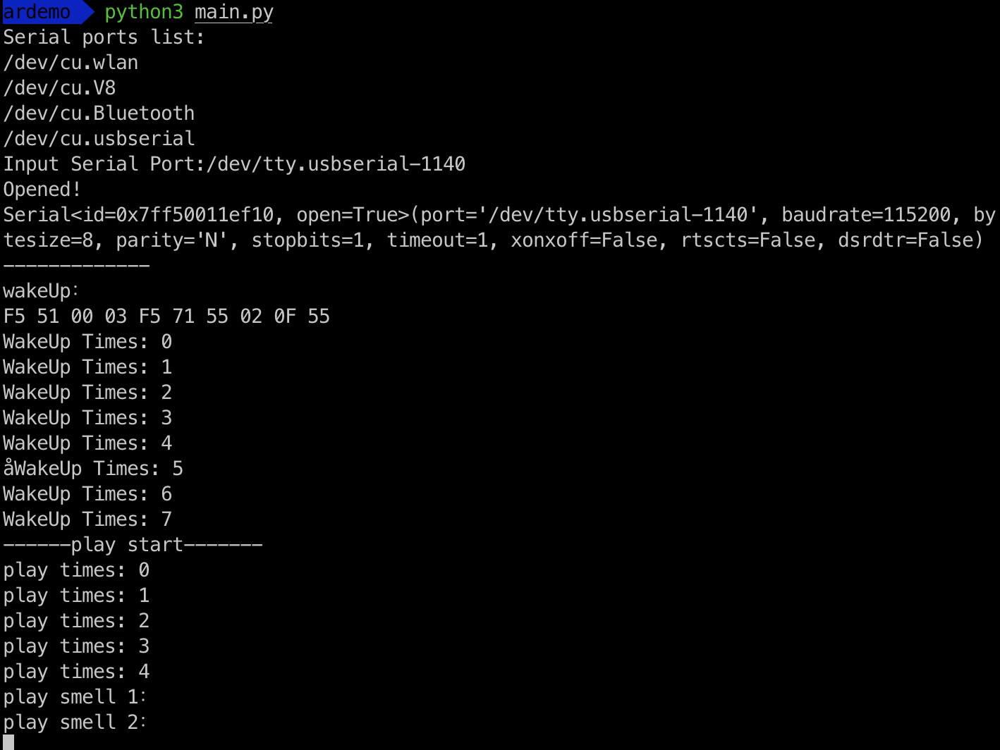

# Neckwears sdk
SDK for NeckWears

#User Wizard：

  1. Download github store: 
  
  	  open git tools and download demos
  
	  ```
	  git clone https://github.com/Scentrealm/neckwearsdks.git
	  ```

  2. Install SDK File
  
	  ```
	  pip install ScentRealmForNeckWear-1.0.2-py3-none-any.whl
	  ```
  
  3. Open Demo

     Open demo with PyCharm IDE or other IDE,Run the demo;
     
  4. Example Analysis
  

	    ```    
		#This is a sample Python script.
	
		import binascii
		import sys
		
		from ScentRealmForNeckWear.ScentRealmProtocol import NeckWear
		import serial.tools.list_ports
		import random
		import time
		import serial
	
		def sendcmd(myser, cmd_str):
		
		    if myser:
		        cmd = cmd_str
		        print('play cmd:')
		        print(cmd)
		        hexstr = cmd.replace(' ', '')
		
		        bs = bytearray()
		        for i in range(0, len(hexstr), 2):
		            item_hex = hexstr[i:i+2]
		            item_int = int(item_hex, base=16)
		            bs.append(item_int)
		        v3 = bytes(bs) #得到数组
		        v4 = binascii.a2b_hex(hexstr)
		
		        byte_array = bytearray(binascii.unhexlify(hexstr))  # 将十六进制字符串转换为字节数组
		        myserial.write(v3)
		
		def pack_data(cmd_str):
		
		    cmd = cmd_str
		    hexstr = cmd.replace(' ', '')
		    bs = bytearray()
		    for i in range(0, len(hexstr), 2):
		        item_hex = hexstr[i:i + 2]
		        item_int = int(item_hex, base=16)
		        bs.append(item_int)
		    v3 = bytes(bs)  # 得到数组
		    v4 = binascii.a2b_hex(hexstr)
		    return v4
		
		def getsportlist():
		
		    port_list = list(serial.tools.list_ports.comports())
		    sportnames = []
		    if len(port_list) == 0:
		        print("NO serial port!")
		    else:
		        print("Serial ports list:")
		        for i in range(0, len(port_list)):
		            print(str(port_list[i]).split('-')[0].strip())
	
		if ____name____ == '____main___':
		
		    #serialworker = SerialWorker('COM3')
		    #serialworker.port = 'COM3'
		    # rtn = serialworker.open_port()
		    # print(rtn)
		    # time.sleep(3)
		
		    # Get System port list
		    getsportlist()
		
		    strPortNum = ""
		    # Set Device Connect Port
		    strport = input("Input Serial Port:")
		    if len(strport) > 0:
		        strPortNum = strport
		    else:
		        strPortNum = 'COM3'
		    # Build Serial Object
		    myserial = serial.Serial(port=strPortNum, baudrate=115200, bytesize=serial.EIGHTBITS, parity='N',
		                             stopbits=1, rtscts=False, dsrdtr=False, timeout=1, xonxoff=False)
		    if myserial.is_open:
		        print('Opened!')
		    else:
		        myserial.open()
		
		    print(myserial)
		
		    # Create SDK Object
		    nw = NeckWear()
		
		    # Get Device Channel,If Receive Channel Equal To Your Sets
		    str1 = nw.getUuid()
		    print('get dev Channel(Uuid)：')
		    print(str1)
		    myserial.write(bytes.fromhex(str1))
		    time.sleep(3)
		    # Get Data Receive
		    receives = myserial.read_all()
		    if receives:
		        hex_string = ' '.join(format(b, '02X') for b in receives)
		        cmd, str1 = nw.cmdParse(hex_string)
		        print('cmdParse channel num：')
		        print('Get Channel Num Cmd:', cmd)
		        print('Channel Num:', str1)
		
		    print('-------------')
		    # Build WakeUp Cmd
		    str1 = nw.wakeUp()
		    print('wakeUp：')
		    print(str1)
		
		    for a in range(10):
		        myserial.write(pack_data(str1))
		        print(str.format('WakeUp Times: {}', a))
		        time.sleep(1)
		
		    print('------play start-------')
		
		    print('play smell 1：')
		    str2 = 'F5 51 00 13 F5 01 00 01 02 FF FF 01 00 00 00 0B 00 00 27 10 02 45 55 04 3A 55'
		    myserial.write(pack_data(str2))
		    time.sleep(4)
		    print('play smell 2：')
		    str2 = 'F5 51 00 13 F5 01 00 01 02 FF FF 01 00 00 00 05 00 00 27 10 02 3F 55 04 2E 55'
		    # serialworker.send_data(str2)
		    myserial.write(pack_data(str2))
		    time.sleep(3)
		
		    # Build playSmell Cmd By Random And Send
		    for i in range(24):
		        scentid = random.randint(1, 12)
		        # playsmell by scent id and times(s)
		        str1 = nw.playSmell(scentid, 10)
		        print(str1)
		        print(str.format('play channel: {}', scentid))
		        myserial.write(pack_data(str1))
		        time.sleep(5)
		
		    print('-------------')
		
		    # Build stopPlay Cmd
		    str1 = nw.stopPlay()
		    print('stopPlay：')
		    myserial.write(pack_data(str1))
		    print(str1)
		
		    # close device(Serial Port)
		    myserial.close()
		
		    # Build setNeckWearChl(NeckWear Device) Cmd: 433 Module communication channel, One Device UID:'56FF6A067875535658261267'
		    str1 = nw.setNeckWearChl(150, '56 FF 6A 06 78 75 53 56 58 26 12 67')
		    print('setNeckWearChl：')
		    print(str1)
		
		    # Build Set USB remote control Equip Cmd: 433 Module communication channel
		    str1 = nw.setHandset(160)
		    print('setHandset：')
		    print(str1)
		
		    # Parse Cmd Examples,Data Receive By setNeckWearChl Cmd
		    strtmp = 'F5 D1 00 18 F5 01 00 01 02 00 00 A2 56 FF 6A 06 78 75 53 56 58 26 12 67 00 04 F8 55 08 27 55'
		    cmd, str1 = nw.cmdParse(strtmp)
		    print('cmdParse0：')
		    print(cmd)
		    print(str1)
		
		    # Parse Cmd Examples,Data Receive By setHandset Cmd
		    strtmp = 'F5 A6 00 00 A6 55'
		    cmd, str1 = nw.cmdParse(strtmp)
		    print('cmdParse1：')
		    print(cmd)
		    print(str1)
	
		 ```    


  5. Result(More about in Images Folder):
	 
	 Running at Windows:
	 
	 
	 
	 
	 
	 Running at Mac:
	 
	 
	 
	 
	 
	 